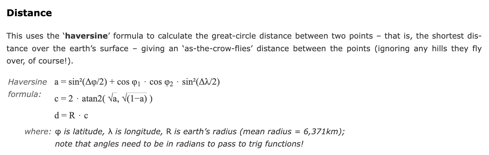

# geo-proximity-calculator

**Mission of the module:**  If the user gives you two arrays of geo location, match each point in the first array to the closest one in the second array.

## Getting Started:

1. Clone & Enter the Repository:<br>
```git clone https://github.com/nhathout/geo-proximity-calculator.git```<br>
```cd geo-proximity-calculator```

2. Make sure you have Python 3.x installed (tested up to 3.11+)

3. Run the program:<br>
```python main.py``` or ```python3 main.py```

4. Follow the on-screen prompts:
 - Decide how to load the FIRST array (CSV or manually)
 - Decide how to load the SECOND array (CSV or manually)

5. To enter latitude and longitude from a CSV:<br>
Ensure the repository is correctly cloned onto your machine. Paste any CSV into ```csv_testing/``` directory for simplicity. Then copy & paste the full path into the command line after prompting the program that you will be using CSV data. (copy & pasting without putting the CSV file into ```csv_testing/``` should also work)

## Solution Design:

1. **`haversine_distance(lat1, lon1, lat2, lon2)`**
    - credit to [https://www.movable-type.co.uk/scripts/latlong.html](https://www.movable-type.co.uk/scripts/latlong.html) :



2. **`find_closest_point(temp_lat, temp_lon, array_of_coords)`**
    - "array-to-point"
    - takes a temp point (```temp_lat``` & ```temp_lon```) and a list of coordinates and returns the closest coordinate and the distance to that coordinate.

3. **`pair_arrays(array1, array2)`**
    - "array-to-array"
    - iterates over each point in ```array1``` calling ```find_closestpoint()``` with ```array2``` as the inputs. 
    - returns list of matched pairs and their respective distances.

4. **`get_valid_input(prompt, min_val=None, max_val=None)`**
    - Helper function that asks/prompts users repeatedly until a valid value is entered.

5. **`get_dms(is_lat=True)`**  
   - Prompts for degrees, minutes, and seconds for either latitude or longitude.  
   - Converts the values to a **decimal degree** float.  
   - Enforces appropriate ranges (±90° for latitude, ±180° for longitude).

6. **`get_point(is_lat=True)`**  
   - Asks whether the user wants to enter decimal degrees or degrees-minutes-seconds.  
   - Calls either `get_valid_input` or `get_dms` based on the user’s choice.

7. **`get_points_manually(label)`**  
   - Repeatedly prompts the user for latitude/longitude inputs, storing them as tuples.  
   - Returns a list of `(lat, lon)` pairs.

8. **`parse_coordinate(value)`**  
   - Parses a **string** coordinate (e.g. `"33.8688° S"`, `"40.7128° N"`, `"151.2093"`) into a **float**.  
   - Interprets trailing **N, S, E, W** to determine the sign of the coordinate.  
   - Returns `None` if parsing fails.

9. **`load_points_csv(label)`**  
   - Prompts for a **CSV file path** and reads lat/long columns from it.  
   - Attempts to parse columns named `"latitude"`, `"lat"`, `"Latitude"` (for lat) and `"longitude"`, `"lon"`, `"Longitude"` (for lon).  
   - Uses `parse_coordinate` to handle N/S/E/W or plain decimals.  
   - Returns a list of `(lat, lon)` tuples, skipping any rows it can’t parse.

## Logging Documentation

This project uses Python’s built-in logging in `main.py`. By default, the logger is set to `INFO` level:

```logger.setLevel(logging.INFO)```

You can change the level of logging in `main.py` to `NOTSET`, `DEBUG`, `INFO`, `WARNING`, `ERROR`, `CRITICAL` to tune the amount of logging detail you would like outputted to your console.